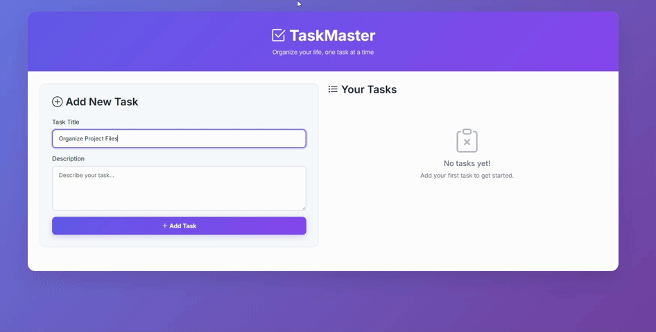

# Todo Task Management Application

A full-stack web application for managing todo tasks with a clean, modern interface. Built with PHP, MySQL, and vanilla JavaScript, containerized with Docker for easy deployment and development.

## 🎥 Demo Video



*Demo showing the complete user workflow: adding tasks, viewing recent tasks, and marking tasks as completed.*

## 📋 Table of Contents

- [Overview](#overview)
- [Architecture](#architecture)
- [Features](#features)
- [Tech Stack](#tech-stack)
- [Prerequisites](#prerequisites)
- [Installation & Setup](#installation--setup)
- [Usage](#usage)
- [API Documentation](#api-documentation)
- [Database Schema](#database-schema)
- [Project Structure](#project-structure)
- [Development](#development)
- [Testing](#testing)
- [Deployment](#deployment)
- [Contributing](#contributing)
- [License](#license)

## 🔍 Overview

This todo application implements a clean three-tier architecture with a MySQL database, PHP REST API backend, and a responsive frontend. The application allows users to create, view, and complete tasks efficiently, displaying only the 5 most recent incomplete tasks for optimal user experience.

### Key Requirements Fulfilled
- ✅ Create tasks with title and description
- ✅ Display 5 most recent incomplete tasks
- ✅ Mark tasks as completed (removes from view)
- ✅ REST API backend with proper endpoints
- ✅ Relational database storage
- ✅ Containerized with Docker
- ✅ Clean separation of concerns (MVC pattern)

## 🏗️ Architecture

The application follows a layered architecture pattern:

```
┌─────────────────┐
│   Frontend UI   │ ← HTML/CSS/JavaScript
├─────────────────┤
│   REST API      │ ← PHP Endpoints
├─────────────────┤
│   Business      │ ← Controllers & Models
│   Logic         │
├─────────────────┤
│   Database      │ ← MySQL
└─────────────────┘
```

### Component Interaction Flow
1. **Frontend** sends HTTP requests to REST API endpoints
2. **API Layer** validates requests and delegates to controllers
3. **Controller Layer** handles business logic and coordinates with models
4. **Model Layer** manages data persistence and database operations
5. **Database Layer** stores and retrieves task data

## ✨ Features

### Core Functionality
- **Task Creation**: Add new tasks with title and description
- **Task Viewing**: Display 5 most recent incomplete tasks
- **Task Completion**: Mark tasks as done (hides from active view)
- **Real-time Updates**: Automatic refresh after operations

### Technical Features
- **RESTful API**: Clean HTTP endpoints following REST principles
- **MVC Architecture**: Separation of concerns for maintainability
- **Prepared Statements**: SQL injection protection
- **CORS Support**: Cross-origin request handling
- **Error Handling**: Comprehensive error responses
- **Docker Containerization**: Consistent development/production environments

## 🛠️ Tech Stack

### Backend
- **Language**: PHP 8.1
- **Web Server**: Apache 2.4
- **Database**: MySQL 5.7
- **Architecture Pattern**: MVC (Model-View-Controller)

### Frontend
- **Markup**: HTML5
- **Styling**: CSS3
- **Scripting**: Vanilla JavaScript (ES6+)
- **API Communication**: Fetch API

### DevOps & Infrastructure
- **Containerization**: Docker & Docker Compose
- **Database Management**: MySQL with automated schema initialization
- **Process Management**: Docker multi-container orchestration

### Development Tools
- **Version Control**: Git
- **Container Registry**: Docker Hub
- **Documentation**: Markdown

## 📋 Prerequisites

Before running this application, ensure you have the following installed:

- **Docker Desktop** (version 4.0+)
    - [Download for Windows](https://desktop.docker.com/win/main/amd64/Docker%20Desktop%20Installer.exe)
    - [Download for macOS](https://desktop.docker.com/mac/main/amd64/Docker.dmg)
    - [Install on Linux](https://docs.docker.com/engine/install/)
- **Git** (for cloning the repository)
- **Web Browser** (Chrome, Firefox, Safari, or Edge)

### System Requirements
- **RAM**: Minimum 4GB (8GB recommended)
- **Storage**: 2GB free space
- **Network**: Internet connection for initial Docker image downloads

## 🚀 Installation & Setup

### 1. Clone the Repository
```bash
git clone https://github.com/PixelNaveen/simple-todo-app.git
cd simple-todo-app
```

### 2. Verify Project Structure
Ensure your directory structure matches:
```
simple-todo-app/
├── api/
│   ├── addTask.php
│   ├── getTasks.php
│   └── markDone.php
├── assets/
│   ├── app.js
│   └── style.css
├── index.php
├── config/
│   └── db.php
├── db/
│   └── init.sql
├── src/
│   ├── Controller/
│   │   └── TaskController.php
│   └── model/
│       └── Task.php
├── docker-compose.yml
└── Dockerfile

```

### 3. Start Docker Desktop
Ensure Docker Desktop is running (check for Docker whale icon in system tray).

### 4. Build and Launch Application
```bash
# Build and start all services
docker-compose up --build

# Or run in detached mode (background)
docker-compose up --build -d
```

### 5. Wait for Initialization
Monitor logs until you see:
```
todo-db   | MySQL init process done. Ready for start up.
todo-web  | Apache/2.4.62 (Debian) PHP/8.1.33 configured
```

### 6. Access Application
Open your browser and navigate to:
```
http://localhost:8080
```

## 📖 Usage

### Adding a New Task
1. Enter a **title** in the first input field
2. Enter a **description** in the textarea
3. Click the **"Add"** button
4. Receive confirmation alert
5. Task appears in the list below

### Viewing Tasks
- The application automatically displays the **5 most recent** incomplete tasks
- Each task shows:
    - Task title
    - Task description
    - Creation timestamp
    - "Done" button

### Completing a Task
1. Click the **"Done"** button on any task
2. Confirm the action in the dialog
3. Task is marked as completed and removed from view
4. List automatically refreshes

## 📡 API Documentation

### Base URL
```
http://localhost:8080/api
```

### Endpoints

#### GET /getTasks.php
Retrieve the 5 most recent incomplete tasks.

**Response Format:**
```json
[
  {
    "id": 1,
    "title": "Sample Task",
    "description": "Task description here",
    "created_at": "2025-07-23 17:30:00",
    "completed": false
  }
]
```

**Status Codes:**
- `200 OK`: Tasks retrieved successfully
- `500 Internal Server Error`: Database connection failed

#### POST /addTask.php
Create a new task.

**Request Body:**
```json
{
  "title": "New Task Title",
  "description": "Detailed task description"
}
```

**Response Format:**
```json
{
  "success": true,
  "message": "Task added successfully."
}
```

**Status Codes:**
- `200 OK`: Task created successfully
- `400 Bad Request`: Missing title or description
- `500 Internal Server Error`: Database operation failed

#### POST /markDone.php
Mark a task as completed.

**Request Body:**
```json
{
  "id": 1
}
```

**Response Format:**
```json
{
  "success": true,
  "message": "Task marked as completed."
}
```

**Status Codes:**
- `200 OK`: Task updated successfully
- `400 Bad Request`: Missing task ID
- `404 Not Found`: Task not found
- `500 Internal Server Error`: Database operation failed

### CORS Headers
All API endpoints include CORS headers for cross-origin access:
```
Access-Control-Allow-Origin: *
Access-Control-Allow-Methods: GET, POST
Access-Control-Allow-Headers: Content-Type
```

## 🗄️ Database Schema

### Table: `task`

| Column | Type | Constraints | Description |
|--------|------|-------------|-------------|
| `id` | INT | PRIMARY KEY, AUTO_INCREMENT | Unique task identifier |
| `title` | VARCHAR(255) | NOT NULL | Task title |
| `description` | TEXT | NULL | Detailed task description |
| `created_at` | DATETIME | DEFAULT CURRENT_TIMESTAMP | Creation timestamp |
| `completed` | BOOLEAN | DEFAULT FALSE | Completion status |

### Indexes
- **Primary Key**: `id` (clustered index)
- **Query Optimization**: Consider adding index on `(completed, created_at)` for frequent queries

### Sample Data
```sql
INSERT INTO task (title, description) VALUES 
('Setup Development Environment', 'Install Docker, configure project structure'),
('Implement API endpoints', 'Create REST endpoints for CRUD operations'),
('Design User Interface', 'Create responsive frontend with modern styling');
```

## 📁 Project Structure

```
simple-todo-app/
├── 🔌 api/                        # REST API endpoints
│   ├── ➕ addTask.php             # Create task endpoint
│   ├── 📋 getTasks.php            # Retrieve tasks endpoint
│   └── ✅ markDone.php            # Complete task endpoint
├── 📦 assets/                     # Static assets
│   ├── ⚡ app.js                  # Frontend JavaScript
│   └── 🎨 style.css               # Application styling
├── 🏠 index.php                   # Main application entry point
├── ⚙️ config/                     # Configuration files
│   └── db.php                    # Database connection
├── 🗄️ db/                        # Database scripts
│   └── init.sql                  # Schema initialization
├── 🧠 src/                       # Application logic
│   ├── 🎮 Controller/            # Business logic controllers
│   │   └── TaskController.php
│   └── 📊 model/                 # Data access layer
│       └── Task.php
├── 📋 docker-compose.yml         # Multi-container orchestration
└── 🐳 Dockerfile                 # Web container configuration

```

### Architecture Layers


## 🎨 Presentation Layer (`Assessment/`)

Handles the user interface and interaction.

- **`index.php`**  
  Main UI file displaying the form and task list.

- **`assets/`**  
  Contains static frontend resources:
    - CSS stylesheets
    - JavaScript files

- **`api/`**  
  Contains HTTP endpoint handlers that bridge frontend requests to backend logic.


## 🧠 Business Logic Layer (`src/`)

Manages application rules and request processing.

- **`Controller/`**  
  Contains scripts for handling incoming HTTP requests, coordinating logic, and formatting responses.

- **`model/`**  
  Includes classes and functions to interact with the database and apply business rules.


## 🗄️ Data Layer (`config/`, `db/`)

Responsible for data persistence and configuration.

- **`config/`**  
  Database configuration files (e.g., credentials, connection setup).

- **`db/`**  
  SQL schema definitions and migration scripts to set up and evolve the database structure.


## 🛠️ Infrastructure Layer

Defines the containerization and orchestration setup for running the application.

- **`Dockerfile`**  
  Specifies the PHP/Apache environment, installs dependencies, and copies source files into the container.

- **`docker-compose.yml`**  
  Defines and links services like the application and the MySQL database.

## 🔧 Development

### Local Development Setup
```bash
# Clone repository
git clone https://github.com/PixelNaveen/simple-todo-app.git
cd simple-todo-app

# Start development environment
docker-compose up --build

# Access application
open http://localhost:8080
```

### Making Changes

#### Backend Changes
1. Modify PHP files in `api/`, `src/`
2. Restart containers: `docker-compose restart web`
3. Changes reflect immediately (volume mounted)

#### Frontend Changes
1. Edit files in `assets/`
2. Refresh browser to see changes
3. No container restart required

#### Database Changes
1. Modify `db/init.sql`
2. Rebuild database:
   ```bash
   docker-compose down -v
   docker-compose up --build
   ```

### Debugging

#### Application Logs
```bash
# View all logs
docker-compose logs

# Follow logs in real-time
docker-compose logs -f

# View specific service logs
docker-compose logs web
docker-compose logs db
```

#### Database Access
```bash
# Connect to MySQL container
docker exec -it todo-db mysql -u root -p
# Password: root

# Query tasks
USE todoapp;
SELECT * FROM task;
```

#### File System Access
```bash
# Access web container
docker exec -it todo-web bash

# Navigate to application root
cd /var/www/html
ls -la
```

## 🧪 Testing

### Manual Testing Checklist

#### Functionality Tests
- [ ] **Task Creation**
    - [ ] Valid task with title and description
    - [ ] Empty title validation
    - [ ] Empty description validation
    - [ ] Special characters in title/description
    - [ ] Very long title/description

- [ ] **Task Display**
    - [ ] Empty state (no tasks)
    - [ ] Single task display
    - [ ] Multiple tasks display
    - [ ] Maximum 5 tasks shown
    - [ ] Correct chronological order

- [ ] **Task Completion**
    - [ ] Mark single task as done
    - [ ] Task disappears from list
    - [ ] New tasks appear after completion
    - [ ] Database persistence

#### API Tests
Test endpoints directly:

```bash
# Test getTasks
curl http://localhost:8080/api/getTasks.php

# Test addTask
curl -X POST http://localhost:8080/api/addTask.php \
  -H "Content-Type: application/json" \
  -d '{"title":"Test Task","description":"Test Description"}'

# Test markDone
curl -X POST http://localhost:8080/api/markDone.php \
  -H "Content-Type: application/json" \
  -d '{"id":1}'
```

#### Browser Testing
- [ ] Chrome (latest)
- [ ] Firefox (latest)
- [ ] Safari (latest)
- [ ] Edge (latest)

#### Responsive Testing
- [ ] Desktop (1920x1080)
- [ ] Tablet (768x1024)
- [ ] Mobile (375x667)

### Automated Testing Setup

#### Backend Unit Tests (Future Enhancement)
```php
// Example test structure
class TaskControllerTest extends PHPUnit\Framework\TestCase {
    public function testAddTask() {
        // Test implementation
    }
}
```

#### Frontend Tests (Future Enhancement)
```javascript
// Example test with Jest
describe('Task Management', () => {
    test('should add new task', () => {
        // Test implementation
    });
});
```

## 🚀 Deployment

### Production Deployment

#### Docker Production Build
```dockerfile
# Multi-stage production Dockerfile
FROM php:8.1-apache as production

# Install extensions
RUN docker-php-ext-install mysqli

# Copy application
COPY . /var/www/html

# Set permissions
RUN chown -R www-data:www-data /var/www/html
RUN chmod -R 755 /var/www/html

# Security configurations
RUN a2enmod rewrite
COPY apache-config.conf /etc/apache2/sites-available/000-default.conf
```

#### Environment Variables
```bash
# Production environment variables
DB_HOST=production-db-host
DB_USER=app_user
DB_PASS=secure_password
DB_NAME=todoapp_prod
```

#### Docker Compose Production
```yaml
version: '3.8'

services:
  db:
    image: mysql:5.7
    container_name: todo-db
    restart: always
    environment:
      MYSQL_ROOT_PASSWORD: root
      MYSQL_DATABASE: todoapp
    volumes:
      - ./db/init.sql:/docker-entrypoint-initdb.d/init.sql
    ports:
      - "3307:3306"

  web:
    build: .
    container_name: todo-web
    restart: always
    ports:
      - "8080:80"
    depends_on:
      - db
    volumes:
      - .:/var/www/html

```

### Cloud Deployment Options

#### AWS ECS
- Use AWS ECS with Fargate for serverless containers
- RDS MySQL for managed database
- Application Load Balancer for traffic distribution

#### Google Cloud Run
- Deploy containers to Cloud Run
- Cloud SQL for MySQL
- Cloud Build for CI/CD

#### Azure Container Instances
- Deploy to ACI for simple container hosting
- Azure Database for MySQL
- Azure DevOps for pipeline

### Security Considerations

#### Production Security
- [ ] Use HTTPS/TLS encryption
- [ ] Implement input validation
- [ ] Add authentication/authorization
- [ ] Use environment variables for secrets
- [ ] Enable database SSL connections
- [ ] Implement rate limiting
- [ ] Add SQL injection protection
- [ ] Sanitize HTML output

## 🤝 Contributing

### Development Workflow
1. **Fork** the repository
2. **Create** a feature branch (`git checkout -b feature/amazing-feature`)
3. **Commit** changes (`git commit -m 'Add amazing feature'`)
4. **Push** to branch (`git push origin feature/amazing-feature`)
5. **Open** a Pull Request

### Code Standards
- **PHP**: Follow PSR-12 coding standards
- **JavaScript**: Use ES6+ features, consistent formatting
- **SQL**: Use uppercase keywords, proper indentation
- **Comments**: Document complex logic and business rules

### Commit Message Format
```
type(scope): description

[optional body]

[optional footer]
```

Examples:
```
feat(api): add task completion endpoint
fix(frontend): resolve task display issue
docs(readme): update installation instructions
```

----
*This application was developed as a technical assessment demonstrating full-stack development capabilities with modern web technologies and containerization practices.*